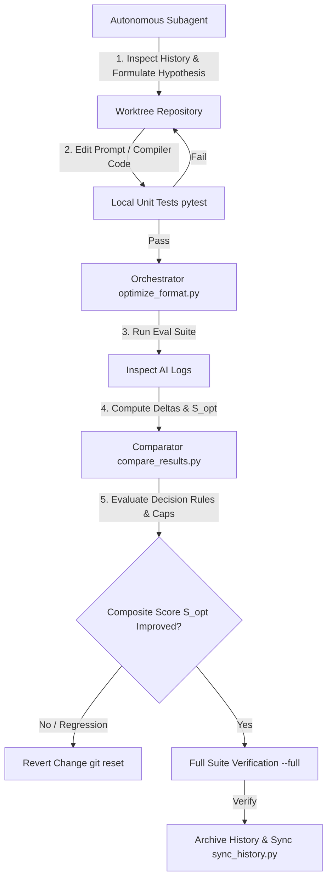
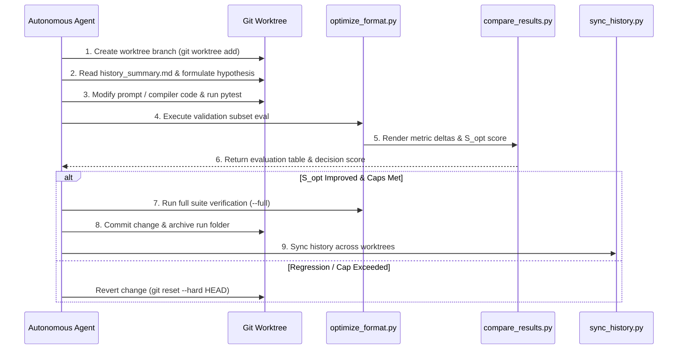

# Architecture & Design: A2UI Inference Format Iteration Framework

This document details the system design, architecture, and mathematical scoring model of the **A2UI Inference Format Iteration Framework**. The framework provides a hybrid algorithmic and LLM-driven optimization pipeline for iteratively designing, evaluating, and refining A2UI inference formats (such as Express, Elemental, and Atom).

For operational execution guidelines followed by autonomous optimization subagents, refer to [`agent_instructions.md`](file:///usr/local/google/home/gspencer/code/a2ui/atom_format/eval/iterative/agent_instructions.md).

---

## 1. System Architecture Overview

The framework employs a **hybrid architecture** combining deterministic Python orchestration tools with autonomous LLM decision agents working in isolated Git worktrees.

---

## 2. Core System Components

### 2.1 The Algorithmic Orchestrator ([`optimize_format.py`](file:///usr/local/google/home/gspencer/code/a2ui/atom_format/eval/iterative/optimize_format.py))
The orchestrator automates pytest unit conformance testing, Inspect AI benchmark execution, log extraction, and diagnostic report generation.

* **Validation Subset Mode (Default)**: Executes a fast 6-prompt representative validation subset (`dogBreedGenerator`, `loginForm`, `settingsPage`, `productGallery`, `productGalleryData`, `updateDataModel`) to enable ~15-second iteration cycles.
* **Full Suite Mode (`--full`)**: Executes the complete evaluation suite across all benchmark prompts for milestone verification.
* **Targeted Debugging Mode (`--prompt <name>`)**: Filters evaluation to specific failing prompt templates.

### 2.2 The Baseline & Delta Comparator ([`compare_results.py`](file:///usr/local/google/home/gspencer/code/a2ui/atom_format/eval/iterative/compare_results.py))
Parses Inspect AI logs and baseline results, computing per-sample medians (or mean averages with `--average`), 1:1 metric deltas, and the composite format score ($S_{\text{opt}}$).

* **Dynamic 1:1 Baseline Sample Filtering**: When evaluating a validation subset against a full baseline, `compare_results.py` automatically filters the baseline metrics to the exact matching sample IDs for accurate 1:1 metric comparisons.

### 2.3 The Multi-Worktree History Synchronizer ([`sync_history.py`](file:///usr/local/google/home/gspencer/code/a2ui/atom_format/eval/iterative/sync_history.py))
Enables safe, concurrent multi-agent optimization by collecting archived history run folders across Git worktrees into the main repository history.

* **Zero-Collision ID Re-indexing**: Detects run ID conflicts across parallel worktree agents and automatically re-indexes incoming run IDs sequentially.
* **Master Index Reconstruction**: Automatically rebuilds [`history_summary.md`](file:///usr/local/google/home/gspencer/code/a2ui/atom_format/eval/iterative/history_summary.md) to maintain collective memory across all past agent experiments.

### 2.4 Autonomous Subagent Prompt Loop ([`agent_instructions.md`](file:///usr/local/google/home/gspencer/code/a2ui/atom_format/eval/iterative/agent_instructions.md))
System prompt and operational workflow instructions that guide autonomous subagents through hypothesis formation, anti-repetition lookup, code modification, and decision rule evaluation.

---

## 3. Formal Scoring & Decision Model

Every candidate format iteration is evaluated against a deterministic decision model consisting of **Correctness Guardrails**, **Efficiency Regression Caps**, and a **Composite Format Score ($S_{\text{opt}}$)**.

### 3.1 Correctness Guardrails (Non-negotiable)
* **Pytest Unit Conformance**: Must be `PASS` (100% unit tests passing).
* **Schema Accuracy (`SchemaAcc`)**: Algorithmic compiler compilation and schema validation pass rate (`a2ui_scorer`). Must be $\ge$ Baseline.
* **Quality Score (`QualityScore`)**: LLM-graded semantic user intent accuracy (`measured_model_graded_qa`). Must be $\ge$ Baseline.

If accuracy degrades below baseline, the iteration is **immediately REVERTED**.

### 3.2 Efficiency Regression Caps (Non-negotiable REVERT Triggers)
Even if accuracy remains equal or 100%, an iteration **MUST BE REVERTED** if any of the following caps are exceeded vs baseline/previous run:

* **Code Output Tokens**: Increases by **> 5%** (prevents format verbosity bloat).
* **Streaming Latency**: `Non-reasoning Output Time` increases by **> 10%** (prevents code streaming bottlenecks).
* **Reasoning Tokens**: `Median Reasoning Tok` increases by **> 15%** (prevents prompt instruction search space ambiguity).

### 3.3 Composite Format Optimization Score ($S_{\text{opt}}$)
To provide a single quantitative objective metric for LLMs and human reviewers to compare candidate runs:

\[
S_{\text{opt}} = 0.50 \times \text{SchemaAcc} + 0.30 \times \text{QualityScore} - 0.15 \times \left(\frac{\text{CodeTok}}{\text{BaseCodeTok}}\right) - 0.05 \times \left(\frac{\text{ReasonTok}}{\text{BaseReasonTok}}\right) - 0.03 \times \left(\frac{\text{InputTok}}{\text{BaseInputTok}}\right)
\]

* **Decision Formula**:
  * If $S_{\text{opt}}(\text{Current}) > S_{\text{opt}}(\text{Baseline})$ $\rightarrow$ **KEEP CHANGE**
  * If $S_{\text{opt}}(\text{Current}) \le S_{\text{opt}}(\text{Baseline})$ $\rightarrow$ **REVERT CHANGE**

---

## 4. Multi-Agent Worktree Architecture & History Memory

### 4.1 Git Worktree Isolation
To prevent race conditions, file modification conflicts, and execution contamination during parallel multi-agent runs:
* Each agent operates in an isolated Git worktree branch (`../worktrees/opt-<format>-<hypothesis_slug>`).
* Code modifications, temporary evaluation logs, and local unit test runs occur exclusively inside that worktree directory.

### 4.2 Self-Contained Archived History Artifacts
Every archived run directory under [`eval/iterative/history/`](file:///usr/local/google/home/gspencer/code/a2ui/atom_format/eval/iterative/history/) contains 4 self-contained artifacts:

1. **`patch.diff`**: Full Git diff patch of all python compiler/decompiler/prompt modifications. Enables instant inspection or re-application (`git apply patch.diff`) independent of branch retention.
2. **`report.md`**: Markdown optimization report with active code diffs, pass/fail tables, and error tracebacks.
3. **`run_meta.json`**: Machine-readable metadata documenting hypothesis, status (`KEEP` vs `REVERT`), commit SHA, and qualitative notes.
4. **`results.json`**: Full Inspect AI execution log data for baseline comparisons.

---

## 5. Iteration & Verification Lifecycle

---

## 6. Framework Reference Links

* **Subagent Operational Instructions**: [`agent_instructions.md`](file:///usr/local/google/home/gspencer/code/a2ui/atom_format/eval/iterative/agent_instructions.md)
* **Algorithmic Orchestrator**: [`optimize_format.py`](file:///usr/local/google/home/gspencer/code/a2ui/atom_format/eval/iterative/optimize_format.py)
* **Results & Delta Comparator**: [`compare_results.py`](file:///usr/local/google/home/gspencer/code/a2ui/atom_format/eval/iterative/compare_results.py)
* **Multi-Worktree History Synchronizer**: [`sync_history.py`](file:///usr/local/google/home/gspencer/code/a2ui/atom_format/eval/iterative/sync_history.py)
* **Master History Summary Index**: [`history_summary.md`](file:///usr/local/google/home/gspencer/code/a2ui/atom_format/eval/iterative/history_summary.md)
