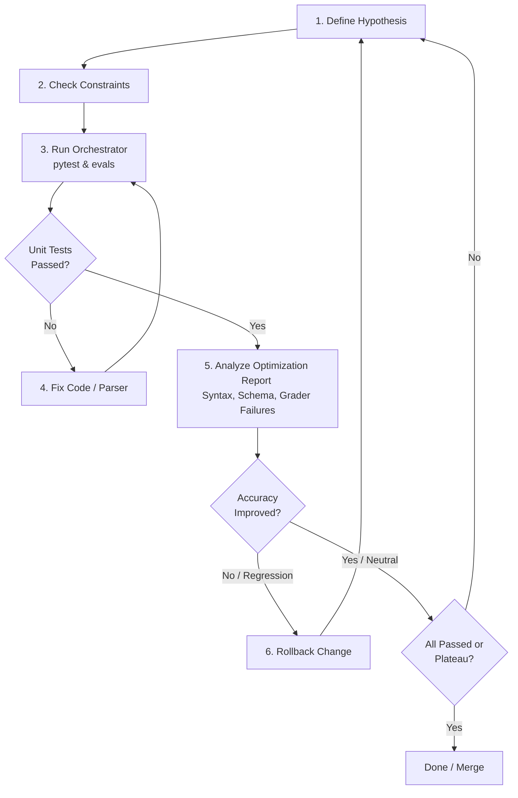

# A2UI Inference Format Iteration Process

This document outlines the standard process for iteratively developing and improving inference formats (e.g., Express, Elemental, Atom) in the A2UI specification. This process is designed to be followed systematically by both human developers and autonomous subagents to continuously optimize formats for LLM generation accuracy, syntax correctness, and schema compliance.

---

## Process Overview



---

## Orchestration Strategy: Hybrid Script & LLM Loop

To optimize format engineering efficiently, the process uses a **hybrid design**:
1. **Algorithmic Script**: A Python orchestrator script (`eval/bin/optimize_format.py`) automates execution, verification, and log compilation. It runs pytest conformance, runs the Inspect AI evaluation suite (subset or full), dumps logs, computes metrics, and compares results against baselines.
2. **LLM Decision Engine**: The subagent reads the human/machine-friendly report generated by the script, identifies semantic failure patterns, generates a hypothesis, makes changes to prompt templates or python parser/compiler/decompiler code, and repeats the loop.

---

## Step 1: Analyze History & Formulate a Well-Reasoned Hypothesis

Before making any changes, establish a clear reasoning for *why* the change will improve model performance or compliance, while ensuring past failed attempts are not repeated.

1. **Inspect Historical Experiment Memory**: Read `eval/iterative/history_summary.md` and scan recent `run_meta.json` files in `eval/iterative/history/` to understand past hypotheses, status (`KEEP` vs `REVERT`), and code diffs.
2. **Anti-Repetition Rule**: Do **NOT** retry a hypothesis or prompt modification that was previously attempted and reverted.
3. **Analyze Unresolved Failure Patterns**: Compare current logs against baseline runs stored under `eval/baselines/{format}/` to identify unaddressed syntax or schema failures.
4. **Formulate a Minimal Hypothesis**: State a specific, targeted modification to:
   - System prompts and format rules (in `prompt_generator.py` or prompt templates).
   - Compiler, decompiler, or parser rules (in `compiler.py`, `decompiler.py`, or `parser.py`).

---

## Step 2: Verify Core Principles and Constraints

Your proposed hypothesis must not violate the following success criteria:

1. **Symmetry (Round-Tripping)**: Compilation and decompilation must be perfectly symmetric.
   - Converting an A2UI JSON payload to the target format and then decompiling it back must result in the equivalent JSON payload.
   - Verify this by ensuring existing round-trip unit tests in `agent_sdks/python/a2ui_agent/tests/{format}/` continue to pass.
2. **Feature Completeness**: All UI components, functions, properties, and message types defined in the A2UI JSON transport schema (`specification/v1_0/json/server_to_client.json`) must be fully implementable in the target format.

---

## Step 3: Run the Orchestration Script (Algorithmic Stage)

The subagent invokes the algorithmic orchestrator script to run tests and collect results.

```bash
# Test Run (Small-Scale Validation - runs the 5 representative validation prompts by default)
uv run python eval/iterative/optimize_format.py --format <format> --model <model>

# Sanity Check Run (Quick 2-sample verification of pipeline correctness)
uv run python eval/iterative/optimize_format.py --format <format> --model <model> --sanity

# Targeted Debug Run (Filters dataset to run ONLY specified prompts; can specify --prompt multiple times)
uv run python eval/iterative/optimize_format.py --format <format> --model <model> --prompt <prompt_name_1> --prompt <prompt_name_2>

# Full Suite Run (Executes the entire 50+ prompt evaluation suite)
uv run python eval/iterative/optimize_format.py --format <format> --model <model> --full
```

### Script Execution Sequence:
1. **Run Unit Tests**: Executes `pytest` on `agent_sdks/python/a2ui_agent/tests/`. If unit tests fail, the script terminates immediately. The subagent **MUST** classify the test failure before proceeding:
   - **Prompt-Only Regression**: If only prompt files were modified and unit tests fail, it is a prompt regression. You **MUST** immediately revert the prompt change.
   - **Parser/Compiler Regression**: A change broke existing parser/compiler behavior. The subagent must revert or fix the compiler code.
   - **Format Capability Evolution**: The compiler was deliberately modified to support new/updated format syntax, causing old tests to fail. The subagent must update the unit tests under `agent_sdks/python/a2ui_agent/tests/{format}/` to match and cover the new capability.
2. **Run Evals**: Executes Inspect AI evaluations on either a representative small-scale subset (using `--prompt` filters) or the full suite.
3. **Generate Report**: Parses the binary Inspect log using `inspect log dump` and writes a detailed markdown report to `eval/iterative/current_report.md`.

---

## Step 4: Analyze the Optimization Report & Compare Against Baseline

The subagent runs `compare_results.py` to compare current run metrics against the reference baseline directory (`eval/baselines/transport` or `eval/baselines/<format>`):
```bash
uv run python eval/iterative/compare_results.py --baseline eval/baselines/<format> <current_run_dir_or_eval_log>
```
*(By default, this outputs median metrics. Pass `--average` to inspect mean averages).*

### Evaluation & Decision Criteria:
1. **Pytest Conformance Status**: Must be `PASS`.
2. **Correctness Guardrails**: `Schema Acc` and `Quality Score` must be $\ge$ Baseline.
3. **Efficiency Optimization Metrics**:
   - `Median Code Output Tok`: Direct measure of format verbosity. Primary optimization target.
   - `Non-reasoning Output Time`: Estimated time spent streaming output code. Shrinks with code token reduction.
   - `Median Input Tok`: Prompt instructions size. Lower input tokens prevent API throttling.
   - `Parallel Wall Latency`: Concurrency throughput across 10 tasks.
4. **Failure Breakdown**: Categorized details for every failing sample (Parser failures vs LLM Intent failures).

---

## Step 5: Implement Changes and Mitigate Failures

Based on the report analysis, the subagent implements fixes:

1. **Syntax/Parsing Errors**: Adjust the compiler/decompiler parser rules, or improve the format grammar/rules in the prompt.
2. **Schema Validation / Intent Grader Errors**: Refine the system instructions, add clearer formatting specifications, or add negative/positive examples in `prompt_generator.py`.
3. **Safe Modification Guidelines**:
   - **Keep changes minimal**: Make incremental changes to isolate the cause of improvements or regressions.
   - **Preserve docstrings/comments**: Do not delete unrelated comments or instructions.
   - **Run tests early**: Run unit tests (`pytest`) locally before executing expensive LLM evaluations.

---

## Step 6: Iterate, Rollback, and Verify

The optimization loop is governed by strict progression rules:

- **Regression Check**: If the overall pass percentage decreases compared to the previous run, or if new unit test failures are introduced, the subagent **MUST** immediately roll back the changes using Git (`git checkout -- <files>`) and try a different hypothesis.
- **Progression Check**: If accuracy increases or remains neutral without introducing regressions or test failures, the change is accepted. The subagent commits the change locally.
- **Sanity to Full Suite**: Initially, run iterations using the **Small-Scale Validation Set** (5 diverse prompts):
  - `dogBreedGenerator`
  - `loginForm`
  - `settingsPage`
  - `productGallery`
  - `updateDataModel`
- **Full Verification**: Once the validation set achieves 100% success (or plateaus), run the orchestrator against the **Full Suite** to verify that no global regressions were introduced.

---

## Step 7: Termination and Human Escalation

The subagent must exit the loop and report status when:
1. **Target Achieved**: 100% pass rate is reached across the full evaluation suite.
2. **Plateau / No Gain**: Accuracy has not improved after 3 consecutive iterations with different hypotheses.
3. **Max Iterations**: The loop has executed 10 times.
4. **Stuck / Blocked**: If a failure cannot be resolved via prompt tuning or compiler modifications, or if there is an ambiguity in requirements, the subagent must output a summary of the diagnostic state and ask the human user to resolve the blocker.

---

## Iterative History Tracking & Backtracking Strategy

To allow subagents and human developers to track progress, evaluate historical failure modes, and backtrack cleanly from regressions, all optimization runs must be organized under `eval/iterative/`.

### 1. Parallel Agent Isolation with Git Worktrees
When multiple agents or optimization tasks run concurrently, they **MUST** execute in separate git worktrees to prevent file editing conflicts and execution contamination.

#### Naming Conventions for Worktrees and Branches:
* **Branch Name**: `opt-<format>-<hypothesis_slug>[-<agent_id_or_timestamp>]`
  * *Example*: `opt-atom-brackets`
  * *Example*: `opt-atom-nested-layouts-agent-a`
* **Worktree Directory**: `../worktrees/<branch_name>`
  * *Example*: `../worktrees/opt-atom-brackets`

#### Creation Command:
```bash
# Spin up an isolated worktree branch for a new optimization experiment
git worktree add ../worktrees/opt-atom-brackets -b opt-atom-brackets
```
This isolates the codebase changes, pytest outputs, and temporary eval log generations for that specific agent.

### 2. Directory Layout
```
eval/iterative/
├── history_summary.md            # The master index of all runs (automatically generated by the orchestrator)
├── current_report.md             # The optimization report for the most recent run (overwritten each iteration)
└── history/                      # Archived historical iterations (contains folders from all branches)
    ├── run_001_initial_baseline/
    │   ├── report.md
    │   ├── run_meta.json         # Metadata written by the agent (hypothesis, notes, status)
    │   └── patch.diff
    ├── run_002_a8f9c1b_fix_closing_parentheses/
    │   ├── report.md
    │   ├── run_meta.json
    │   └── patch.diff
    └── run_002_f3d2e5a_optimize_list_grammar/
        ├── report.md
        ├── run_meta.json
        └── patch.diff
```

### 3. Naming Conventions and Local Metadata
To prevent namespace collisions and git merge conflicts when merging concurrent optimization branches:
* **Archived Run Folder**: `run_<three_digit_index>_<commit_sha>_<slugified_hypothesis_summary>`
* **Local Run Metadata (`run_meta.json`)**: When initiating an iteration run, the Agent writes a local JSON file inside the archived folder documenting the run's qualitative data:
  ```json
  {
    "hypothesis": "Require layout components to define explicit root IDs",
    "notes": "Introduced minor regressions in nested grids, but improved simple forms",
    "status": "Backtracked"
  }
  ```
* **Patch File**: `patch.diff`. To generate a patch: `git diff > patch.diff`.
  * *Backtracking*: To revert the workspace back to any historical run state, run `git reset --hard HEAD && git apply eval/logs/optimization/history/run_<id>/patch.diff`.

### 4. Master Index & Merge Resolution
The master summary index (`history_summary.md`) is **algorithmically generated** by the orchestrator script to prevent merge conflicts:
1. **Reconstruction**: The orchestrator scans all directories under `history/`, reads the performance metrics from the `report.md`/`results.json`, and parses the qualitative notes from each local `run_meta.json`.
2. **Conflict-Free Merges**: Because agent annotations are saved in branch-unique folders rather than a single shared file, merging concurrent branches into the main repository results in zero git merge conflicts. The script simply regenerates the compiled table index on the next run.

---

## Managing Evaluation Baselines

To avoid re-running expensive and slow full evaluations repeatedly, follow these baseline management practices:

1. **Baseline Directory**: Baseline logs are persisted in `eval/baselines/{format}/`.
2. **Baseline Artifacts**: The baseline folder contains:
   - `results.json`: The detailed JSON dump of the benchmark run.
3. **Generating a Baseline**: To record a new baseline run, execute:
   ```bash
   uv run python eval/bin/optimize_format.py --format <format> --model <model> --save-baseline
   ```
