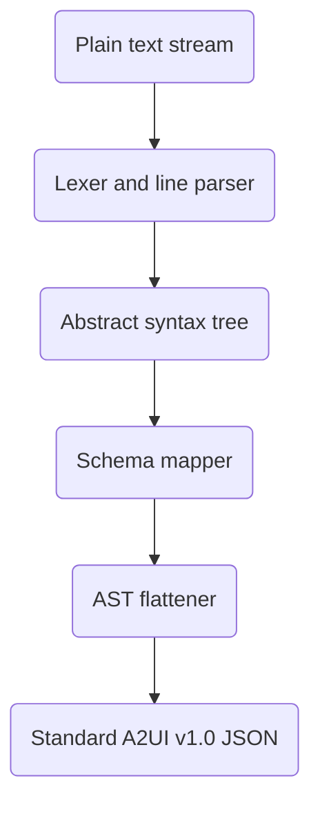

# A2UI Express technical specification

A2UI Express is a compact declarative syntax designed for generative user interfaces. It provides a compressed notation for on-device large language models to output interface layouts. A host compiler parses this syntax and converts it into standard A2UI v1.0 wire protocol messages.

## Core design goals

A2UI Express targets four main requirements:

- **Token reduction**: Removes structural keys, brackets, and quotes. This reduces output token count by 55% to 70% compared to native A2UI wire payloads.
- **On-device model optimization**: Fits positional component signatures into small model context windows, reducing context overhead for models like Gemma 4.
- **Streaming compatibility**: Enables line-by-line parsing and layout construction. The host client renders the interface progressively while the model generates output.
- **Protocol alignment**: Preserves compatibility with standard A2UI v1.0, supporting data bindings, client validation rules, and local events.

### Format comparison

| Characteristic        | Native A2UI v1.0 JSON         | A2UI Express                   | A2UI Atom                | A2UI Elemental          |
| :-------------------- | :---------------------------- | :----------------------------- | :----------------------- | :---------------------- |
| **Primary Structure** | Verbose JSON envelopes        | Line-oriented assignments      | Lisp S-expressions       | HTML5 Web Components    |
| **Token Reduction**   | Baseline (0%)                 | 55% to 70% reduction           | 60% to 75% reduction     | 40% to 60% reduction    |
| **Schema Mapping**    | Named JSON keys               | Positional schema mapping      | Positional & tagged keys | Named HTML attributes   |
| **Streaming Unit**    | Full payload or chunked JSON  | Single statement line          | Open parenthesis `(`     | HTML DOM element        |
| **Error Recovery**    | Strict JSON schema validation | Line isolation & auto-inlining | Auto-closing parentheses | XML-tolerant DOM repair |

## System prompt output contract

Models receive system instructions wrapped in `<a2ui>` and `</a2ui>` sentinel tags. The prompt contract specifies nine rules:

1. **Variable Assignment**: Assign every component to a variable on its own line (`var_name = ComponentName(arg1, arg2, ...)`). Do not pass component constructors inline as arguments.
2. **Root Entry Point**: Assign the top component to the reserved variable `root`. For data-only updates without UI layouts, output data path assignments (such as `$/user/name = "Alice"`) without a `root` variable.
3. **Data Bindings**:
   - Absolute data paths: `$/user/firstName`
   - Relative template paths: `$firstName` (or `$` for the item itself)
4. **Logic and Validation**: Prefix client validation checks with `?` (for example, `?required` or `?regex("^[0-9]{5}$", "Invalid code")`).
5. **Action Events**: Define actions using `Event("name", {context_map})` or function calls like `openUrl("https://example.com")`. If an action property is required but unspecified, pass `Event("click")`.
6. **Data Model Population**: Assign values to absolute data paths (such as `$/user/name = "Alice"`). Values can be primitives, arrays, or maps.
7. **Template Lists**: Declare list templates using `_template($/path/to/list, itemTemplate)`. Define `itemTemplate` on its own line.
8. **Surface Deletion**: Output `deleteSurface("surface-id")` to remove a surface.
9. **Static Properties**: Pass static values or arrays to properties marked `(static only)`. Do not use path bindings (prefixed by `$`) for static properties.

## Syntax and grammar

Enclose A2UI Express blocks in `<a2ui>` and `</a2ui>` sentinel tags:

```
<a2ui>
variable_name = ComponentName(argument1, argument2, ...)
</a2ui>
```

Each instruction is an assignment statement or standalone expression. Separate statements using newlines or semicolons (`;`). The parser supports and skips line comments (`#`, `//`) and block comments (`/* ... */`).

### Variable declarations

Assign every component definition to a unique variable identifier. The compiler uses these variables to build parent-child component trees. The reserved variable `root` defines the primary entry point.

Variable identifiers must conform to the [UAX #31](https://www.unicode.org/reports/tr31/) Unicode Identifier standard:

- An identifier must start with a letter or an underscore `_`.
- Subsequent characters must be letters, digits (`0-9`), or underscores `_`.

The syntax prohibits inline component nesting in prompt rules to simplify line parsing. Component constructors must appear on the right side of an assignment (`var = ComponentName(...)`). If a model outputs inline constructors, the host compiler automatically converts them into internal variables (`_inline_1`, `_inline_2`).

The compiler matches component names case-insensitively against the loaded catalog (for example, `column(...)` maps to `Column`).

### Core primitive types and coercions

The syntax supports four primitive literal types and four automatic compiler coercions:

- **Strings**:
  - **Standard Strings**: Enclosed in quotes (`"Enter name"`) or triple quotes (`"""Line 1\nLine 2"""`). Standard strings support escape sequences (`\n`, `\t`, `\\`, `\"`) and embedded newlines.
  - **Raw Strings**: Prefaced by `r` (`r"^[a-zA-Z]+$"` or `r"""Raw text"""`). Raw strings disable escape processing. Use raw strings for regex patterns with backslashes.
- **Numbers**: Plain integers or decimals (such as `42`, `3.14`, or `-1`).
- **Booleans**: Literal `true` or `false`. String booleans (such as `"true"` or `"false"`) automatically convert to booleans during compilation.
- **Null values**: Represented by `null`.

#### Auto-coercions and normalization

- **Enum Choices**: Enum values match case-insensitively against catalog definitions (`'CENTER'` converts to `'center'`).
- **Option Objects**: Choice component options convert strings or pairs automatically. For example, `"Option A"` converts to `{"label": "Option A", "value": "Option A"}`. A pair `["Label", "val"]` converts to `{"label": "Label", "value": "val"}`.

### Structural lists and maps

- **Lists**: Represent component or primitive arrays using square brackets (`[icon, title]`). The compiler maps array elements to child slots.
- **Map Literals**: Represent key-value dictionaries using curly braces (`{title: "Overview", child: contentCol}`). Map keys are literal string identifiers.

To declare template lists, use the `_template(path, templateComponent)` helper:

```
breedList = List(_template($/breeds, breedTemplate), "horizontal")
```

The first argument to `_template` must be a data path (prefixed by `$`). The second argument is the variable name of the item template component.

### Data binding and reactive paths

Prefix data model paths with the `$` symbol:

- **Absolute paths**: Start with a slash after the prefix (`$/user/email` or `$/user.email`). They resolve from the data model root.
- **Relative paths**: Omit the slash (`$lastName` or `$.lastName`). They resolve within template iteration contexts.
- **Item self reference**: A single `$` represents the current item in a template loop.

The compiler converts dot path separators (`.`) to JSON Pointer slashes (`/`).

### Static property validation

Properties marked `(static only)` in catalog signatures require static values or arrays. The compiler rejects path references (`$`) on static properties and raises a `ValueError`.

### Data model population

To set values in the shared data model, assign values to absolute data paths:

```
$/path/to/key = value_expression
```

The value can be a primitive, array, or map:

```
$/icon = "check"
$/title = "Enable notification"
$/user = {firstName: "Alice", age: 30}
```

The compiler adds these entries to the `dataModel` object in `createSurface` messages.

If a block contains only data path assignments without a `root` variable, the compiler outputs an `updateDataModel` message:

```json
{
  "version": "v1.0",
  "updateDataModel": {
    "surfaceId": "default_surface",
    "path": "/",
    "value": {
      "icon": "check",
      "title": "Enable notification",
      "user": {
        "firstName": "Alice",
        "age": 30
      }
    }
  }
}
```

### Actions and function calls

A2UI Express uses function calls for catalog utilities and actions:

- **Client Functions**: Call catalog functions directly using positional arguments, such as `formatString("Welcome, ${/user/firstName}!")`.
- **Action Schema Detection**: The compiler checks property schemas to detect Action, Event, or FunctionCall types.
- **Server Events**: Declare server events using `Event("name", {context_map})`.
- **String Wrapping**: The compiler converts string action arguments (such as `"click"`) into function call actions: `{"call": "click", "args": {}}`.

### Validation and logic expressions

Prefix validation checks with `?`:

- **Simple checks**: Call check functions directly (for example, `?required`).
- **Parameterized checks**: Pass arguments in parentheses (for example, `?regex("^[0-9]{5}$", "Must be a valid zip code")`).
- **Multiple checks**: Combine rules in an array (for example, `[?required, ?email]`).

#### Implicit value binding and custom messages

- **Implicit Value Binding**: If a check function expects a `value` argument and receives none, the compiler injects the `value` path of the parent input component.
- **Custom Error Messages**: A string argument not consumed by check schema parameters becomes the `message` property. When omitted, the compiler assigns default message `"{CheckName} check failed"`.

### Standalone operations and RPC calls

Call standalone functions on separate lines without variable assignments:

#### Deleting a surface

The `deleteSurface` command generates a surface deletion message:

```
deleteSurface("dashboard-surface-1")
```

```json
{
  "version": "v1.0",
  "deleteSurface": {
    "surfaceId": "dashboard-surface-1"
  }
}
```

#### Executing client functions (RPC)

Other standalone function calls generate a `callFunction` RPC message:

```
openUrl("https://example.com")
```

```json
{
  "version": "v1.0",
  "functionCallId": "call_1",
  "callFunction": {
    "call": "openUrl",
    "args": {
      "url": "https://example.com"
    }
  }
}
```

## Compilation pipeline

The compiler processes plain text streams into standard A2UI v1.0 JSON payloads.



### Line parsing and tokenization

The compiler reads input lines, strips whitespace, and removes comments. ANTLR4 rules in [`Express.g4`](file:///usr/local/google/home/gspencer/code/a2ui/optimize_express/agent_sdks/python/a2ui_agent/src/a2ui/inference_formats/experimental/express/Express.g4) build an Abstract Syntax Tree (AST).

### Error recovery and micro-refinement loop

When the compiler encounters syntax errors or schema violations, it runs an error recovery workflow:

1. **Isolation**: The compiler flags invalid statement lines and continues parsing remaining lines to preserve the surrounding UI layout.
2. **Correction Prompting**: The host constructs a small correction prompt containing the invalid statement line, component signature, and parser error.
3. **Fast Model Correction**: A low-latency model fixes the statement line.
4. **AST Hot-Swapping**: The host replaces the invalid statement in the active AST before emitting JSON output.

### Schema-driven key mapping

The compiler maps positional arguments using the catalog JSON schema:

1. Look up component or function names in the schema case-insensitively.
2. Read property definitions in schema order.
3. Map positional arguments to property keys sequentially.
4. Omit trailing optional arguments.
5. Use `_` placeholders for skipped optional arguments.
6. Remove `null` properties from the finalized JSON output.

### Adjacency list flattening

A2UI v1.0 uses flat component lists with ID references:

1. Traverse component references starting from `root`.
2. Assign unique IDs to inline components (`_inline_1`) and keep assigned variable names as IDs.
3. Package child lists and templates into ID reference structures.
4. Output a single flat `components` array.

### Surface parameters and protocol envelopes

The compiler receives `surface_id` and `catalog_id` parameters during invocation. If omitted, `surface_id` defaults to `"default_surface"` and `catalog_id` defaults to the catalog's declared URI.

## Decompilation pipeline (JSON-to-Express)

The [`_ExpressDecompiler`](file:///usr/local/google/home/gspencer/code/a2ui/optimize_express/agent_sdks/python/a2ui_agent/src/a2ui/inference_formats/experimental/express/decompiler.py#L99) converts standard A2UI v1.0 JSON envelopes back into compact A2UI Express DSL code:

1. **Message Type Resolution**: Maps `createSurface`, `updateDataModel`, `deleteSurface`, and `callFunction` protocol messages into matching Express syntax blocks.
2. **Hierarchy Reconstruction**: Reconstructs adjacency list component arrays into line-by-line variable assignments starting with `root`.
3. **Positional Parameter Mapping**: Strips JSON key names and outputs compact positional arguments matching catalog schema property order.
4. **String Formatting**: Formats text literals using clean double-quoted, triple-quoted, or raw string syntax (`r"..."`).

## Compilation example

This example shows an input DSL block and its compiled A2UI v1.0 JSON message.

### Input text stream

```
<a2ui>
root = Card(main_column)
main_column = Column([icon, title, description, actions])
icon = Icon($/icon)
title = Text($/title)
description = Text($/description, "body")
actions = Row([yes_btn, no_btn], "center")
yes_btn_text = Text("Yes")
yes_btn = Button(yes_btn_text, _, Event("accept"))
no_btn_text = Text("No")
no_btn = Button(no_btn_text, _, Event("decline"))
</a2ui>
```

### Compiled A2UI JSON output

```json
{
  "version": "v1.0",
  "createSurface": {
    "surfaceId": "gallery-notification-permission",
    "catalogId": "https://a2ui.org/specification/v1_0/catalogs/basic/catalog.json",
    "components": [
      {
        "id": "root",
        "component": "Card",
        "child": "main_column"
      },
      {
        "id": "main_column",
        "component": "Column",
        "children": ["icon", "title", "description", "actions"]
      },
      {
        "id": "icon",
        "component": "Icon",
        "name": {
          "path": "/icon"
        }
      },
      {
        "id": "title",
        "component": "Text",
        "text": {
          "path": "/title"
        }
      },
      {
        "id": "description",
        "component": "Text",
        "text": {
          "path": "/description"
        },
        "variant": "body"
      },
      {
        "id": "actions",
        "component": "Row",
        "children": ["yes_btn", "no_btn"],
        "justify": "center"
      },
      {
        "id": "yes_btn_text",
        "component": "Text",
        "text": "Yes"
      },
      {
        "id": "yes_btn",
        "component": "Button",
        "child": "yes_btn_text",
        "action": {
          "event": {
            "name": "accept",
            "context": {}
          }
        }
      },
      {
        "id": "no_btn_text",
        "component": "Text",
        "text": "No"
      },
      {
        "id": "no_btn",
        "component": "Button",
        "child": "no_btn_text",
        "action": {
          "event": {
            "name": "decline",
            "context": {}
          }
        }
      }
    ]
  }
}
```

## Ecosystem integration

A2UI Express runs with any JSON catalog schema.

### Automated catalog-to-prompt utility

Use [`ExpressPromptGenerator`](file:///usr/local/google/home/gspencer/code/a2ui/optimize_express/agent_sdks/python/a2ui_agent/src/a2ui/inference_formats/experimental/express/prompt_generator.py#L98) to build system prompts and signatures directly from a catalog:

```python
from a2ui.core.catalog import Catalog
from a2ui.inference_formats.experimental.express.format import ExpressFormat
from a2ui.inference_formats.experimental.express.prompt_generator import ExpressPromptGenerator

# Load catalog schema
catalog = Catalog.from_json_file("catalog.json", spec_version="0.9.1")
express_format = ExpressFormat(catalog=catalog)
prompt_gen = ExpressPromptGenerator(express_format)

# Generate positional signatures and prompt contract
signatures = prompt_gen.generate_component_signatures()
full_system_prompt = prompt_gen.generate_system_prompt()
```

### Local performance and reasoning token profiles

On-device inference latency depends on the configured reasoning token budget:

- **Simple Views and Dashboards**: Configure a budget of 70 to 140 reasoning tokens for low latency.
- **Complex Interactive Forms**: Configure a budget of 280 to 560 reasoning tokens to prevent hierarchy errors.
