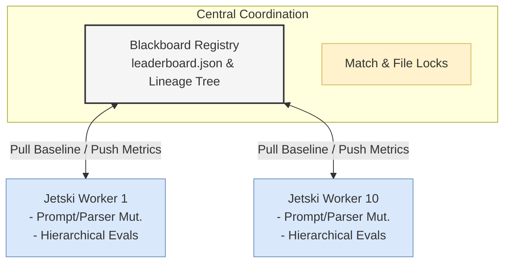
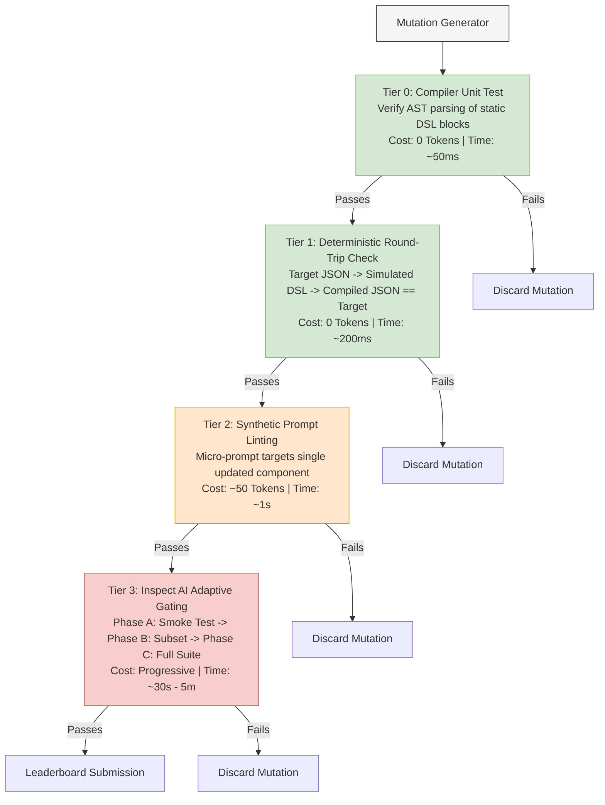
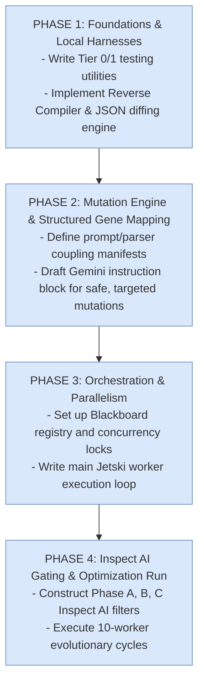

# Design Document: Evolutionary DSL Optimization Platform for A2UI Express

This document details the architectural design and implementation plan for an automated, parallelized evolutionary optimization loop. The goal of this system is to iteratively improve the **A2UI Express technical specification** DSL and its associated LLM prompt to maximize token efficiency, compilation reliability, and semantic accuracy, while minimizing LLM token consumption during the search process.

## 1. Executive Summary & Problem Space

A2UI Express operates as an intermediate, highly compressed inference representation designed for local, small-footprint LLMs (like Gemma). The generation system is dual-sided:

1.  **The Prompt:** Commands the LLM on how to generate the compact positional syntax.
2.  **The Host Compiler:** Parses the generated token stream back into valid A2UI JSON wire protocol.

Optimizing this system requires mutating both sides in lockstep. However, exploring this search space using 10 concurrent agents executing full evaluations across a deep test suite would consume millions of tokens, leading to high latency and prohibitive API costs.

This platform addresses these challenges by combining a **Distributed Blackboard Architecture** on Google Antigravity/Jetski with a multi-tiered, **zero-to-low token evaluation funnel**.

## 2. System Architecture

The platform scales across 10 isolated execution sandboxes provided by Google Jetski. The synchronization of these workers is managed through a central coordinator using a shared file system, GCS, or an active Git tracking branch.



### 2.1 The Central Blackboard

The coordination layer stores global execution metrics, prevents workers from duplicating mutation paths, and resolves conflicts when writing candidate metrics.

*   **Registry Structure (`leaderboard.json`):**

    ```json
    {
      "reigning_champion": "gene_v3_1",
      "history": {
        "gene_v3_1": {
          "parent": "gene_v3_0",
          "fitness_score": 0.89,
          "metrics": {
            "output_compression": 0.68,
            "prompt_footprint_tokens": 420,
            "compilation_rate_gemma": 0.95,
            "refinement_reliance": 0.05,
            "semantic_accuracy": 1.0,
            "expressive_coverage": 1.0
          },
          "artifacts": {
            "prompt_path": "genes/v3_1/system_prompt.txt",
            "parser_path": "genes/v3_1/parser_patch.py"
          }
        }
      }
    }
    ```
*   **Race-Condition Mitigation:** Workers utilize a distributed file-locking key or write to distinct, isolated metric files that are subsequently consolidated by a MapReduce merge pass.

## 3. The Hierarchical Gating Funnel (Token-Saving Strategy)

To drastically reduce token burn, the platform subjects every mutation to a sequential gauntlet. A candidate gene must pass each gate to earn the privilege of escalating to the next, more expensive tier.



### Tier 0: Compiler Validation

*   **Method:** Run mutated compiler parser rules against a fixed set of synthetic A2UI Express expressions.
*   **Failure condition:** Any syntax parser crash, unhandled token exception, or failure to build a valid Abstract Syntax Tree (AST).

### Tier 1: Deterministic Round-Trip Validation

*   **Method:** A deterministic "Reverse Compiler" takes standard A2UI JSON files and translates them into the mutated DSL rules. The mutated compiler then translates them back into standard JSON.
*   **Failure condition:** Deep comparison reveals structural property differences. For instance, if an action event context or data binding like `$/path/to/key` is lost or mismatched, the pipeline aborts.

### Tier 2: Synthetic Prompt Linting

*   **Method:** Fire a micro-request (hard-capped at 30 max tokens) querying the LLM to output a single UI element (e.g., a Submit button with a custom action) using the mutated system prompt instructions.
*   **Failure condition:** The generated line fails to conform to the mutated grammar pattern, or positional arguments map incorrectly to the validation schemas.

### Tier 3: Adaptive Inspect AI Gating

*   **Phase A (Smoke Test):** Run exactly 2 Inspect AI test cases (one lightweight card, one deeply-nested form) targeting lightweight local models (e.g., Gemma E2B/E4B). If performance drops below the reigning champion, stop immediately.
*   **Phase B (Representative Run):** Run 10 benchmark test cases covering diverse data-bindings, validation matrices, and layouts.
*   **Phase C (Full Validation):** Run the full Inspect AI suite to compute the official candidate score for leaderboard submission.

## 4. Evaluative Scoring & Fitness Function

To support the deployment of the DSL on small, fast, local models, the fitness score must reward format readability and brevity while penalizing systemic overhead. We evaluate candidate mutations across structural, token, and compatibility domains.

### 4.1 Variables & Metrics Defined

Let:

*   $E \in \{0, 1\}$ be the **Expressive Coverage Hard-Gate**. A deterministic binary check confirming that 100% of the active A2UI features (nested layouts, absolute/relative bindings, validation schemas, and actions) can be structurally represented by the proposed syntax.
*   $A \in [0, 1]$ be the **Semantic Layout Accuracy**. The exact matching rate of the parsed component tree nodes and parameters to the original golden target design.
*   $S \in [0, 1]$ be the **First-Pass Success Rate on Target Model**. The percentage of test cases that compile successfully without triggering syntax errors on the first attempt when generated by a lightweight model (e.g., Gemma).
*   $T_{\text{out}} \in (-\infty, 1]$ be the **Output Compression Efficiency**, defined relative to standard verbose JSON:

    $$T_{\text{out}} = 1 - \frac{\text{Tokens}_{\text{DSL Output}}}{\text{Tokens}_{\text{Standard A2UI JSON}}}$$
*   $T_{\text{prompt}} \in (-\infty, 1]$ be the **Prompt Footprint Efficiency**, measuring the token size of the system instructions:

    $$T_{\text{prompt}} = 1 - \frac{\text{Tokens}_{\text{Proposed Prompt}}}{\text{Tokens}_{\text{Max Prompt Budget}}}$$

    *(Where the maximum acceptable system instruction prompt budget for a local model context window is capped at 1,000 tokens).*
*   $R \in [0, 1]$ be the **Micro-Refinement Reliance**. The ratio of output lines requiring error-recovery hot-swapping by the host environment.

### 4.2 The Fitness Formula

The overall Fitness Score ($F$) is calculated as follows:

$$F = (E \cdot A) \cdot \left[ w_s \cdot S + w_{\text{out}} \cdot T_{\text{out}} + w_{\text{prompt}} \cdot T_{\text{prompt}} - w_r \cdot R \right]$$

### 4.3 Weights Configuration & Design Rationale

*   **Hard Multiplier (**$E \cdot A$**):** If the mutated DSL cannot express the full layout schema ($E = 0$) or introduces incorrect layout hierarchies ($A < 1.0$), the score scales directly to zero. This prevents optimization algorithms from "cheating" by stripping out complex elements to maximize compression.
*   $w_s = 0.35$ **(First-Pass Success on Small Models):** This parameter heavily rewards simplicity. If the rules are too convoluted, a smaller model like Gemma E2B will generate syntax errors. A high $S$ proves that the DSL is intuitive and fits the reasoning envelope of low-parameter local models.
*   $w_{\text{out}} = 0.35$ **(Output Token Footprint):** Directly linked to inference latency. Fewer tokens generated on the edge translates to lower time-to-completion, reducing generation bottlenecks.
*   $w_{\text{prompt}} = 0.15$ **(Prompt Compactness):** Prevents the agent from creating massive, over-specified prompts. Smaller prompts preserve the model's active memory context and optimize time-to-first-token latency.
*   $w_r = 0.15$ **(Micro-Refinement Penalty):** Subtracts value from solutions that frequently trigger error correction, as client-side refinement round-trips introduce severe latency spikes.

## 5. Implementation Roadmap



## 6. Risks & Mitigation Protocols

### Risk 1: Overfitting to the Test Suite

*   *Symptom:* An agent hardcodes rules into the compiler or prompt that work beautifully for the 30 Inspect AI test cases, but break on new UI layouts.
*   *Mitigation:* Retain a "hidden test suite" of 10 schemas and layouts. The coordinator tests the final reigning champion against this hidden suite to prove generalized capability before declaring success.

### Risk 2: Loop Collapse / Null Convergence

*   *Symptom:* An agent mutates the grammar to be extremely minimal (yielding high compression values), but the changes make standard, non-trivial nested layouts impossible to represent.
*   *Mitigation:* The semantic layout check ($A = 1.0$) prevents this. Any loss in UI fidelity immediately results in a fitness score of zero.

### Risk 3: Catastrophic Parser Backtracking (Regex Hangs)

*   *Symptom:* An agent attempts to optimize parser speed or grammar parsing by modifying line tokenizers using complex Regular Expressions. If a malformed lookaround or greedy operator is written, processing synthetic inputs triggers catastrophic backtracking, locking up the Jetski worker workspace indefinitely.
*   *Mitigation:* Wrap all local Tier 0 parser runs in rigid execution timeouts (`timeout 2s`). If a parser execution hangs, kill the process, drop the candidate immediately, and return a fitness score of 0.

### Risk 4: Safety Alignment Collisions (Over-Refusal)

*   *Symptom:* An evolved DSL syntax accidentally uses symbol combinations or escaped patterns (e.g., specific bracket pairings or punctuation tags) that mirror command-injection payloads. When run against local models (Gemma), safety filters trigger a false positive ("over-refusal"), causing the model to output safety warnings instead of the compiled UI.
*   *Mitigation:* Inspect the output stream of Tier 2 and Tier 3 evaluations for common safety trigger responses (e.g., "I cannot fulfill this request"). If a safety pattern is detected, penalize the candidate by setting the target model success rate ($S$) to 0, signaling the agent to alter the syntax symbols.

### Risk 5: Prompt Fragmenting and Instruction Rot

*   *Symptom:* Rather than revising the core system instruction set gracefully, evolutionary agents append quick "hot-fix patches" (e.g., *"IMPORTANT: Never use brackets for rows inside tabs unless they are buttons..."*) to correct failing edge-cases. Over generations, the prompt becomes a fragmented, contradictory list of exceptions that degrades small-model context window coherence.
*   *Mitigation:* Implement a structural formatting rule in the mutation module. Every $N$ generations, the mutation agent must route the instruction prompt through an "instruction consolidation" pass with Gemini, which refactors the rules into standard declarative layouts without altering grammar mechanics.

### Risk 6: Silent Parser Over-Forgiveness

*   *Symptom:* An agent discovers it can maximize first-pass compilation rates ($S$) by patching the compiler to ignore parsing failures, silently stripping out unparseable lines rather than raising error exceptions. This boosts $S$ but drops semantic accuracy ($A$).
*   *Mitigation:* The strict multiplier dependency $(E \cdot A)$ acts as a absolute gate. By enforcing that semantic layouts must perfectly match ($A = 1.0$), any attempts to increase compilation scores by silently dropping broken UI layers result in an instant fitness score of zero.

### Risk 7: Flaky "Lucky Champion" Flares

*   *Symptom:* An unstable or poorly structured candidate achieves a high evaluation metric on Tier 3 testing due to a lucky generation sequence at temperature $>0$. The candidate becomes the new champion, but subsequent offspring collapse because the genetic baseline is structurally fragile.
*   *Mitigation:* When a candidate registers a score that beats the reigning champion on the leaderboard, the central coordinator subjects the candidate to a high-density "Champion Validation Run" consisting of 3 repeated runs across the full test suite. Only the lowest score among the three runs is logged to the leaderboard as the official baseline score.