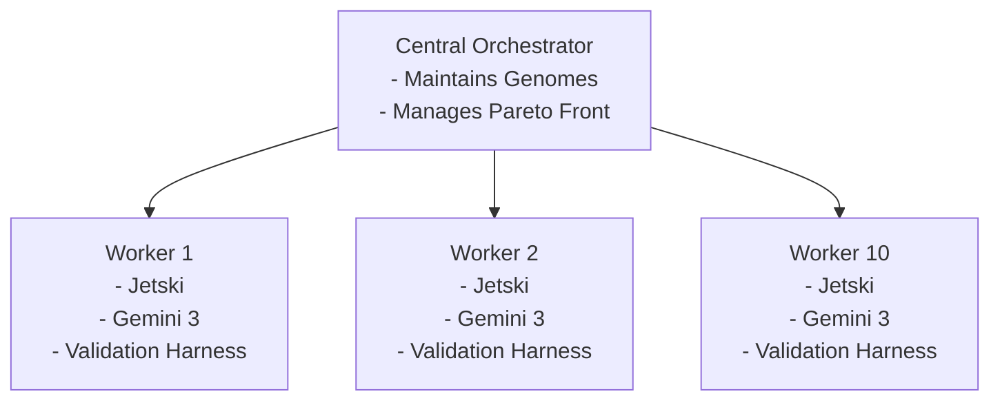
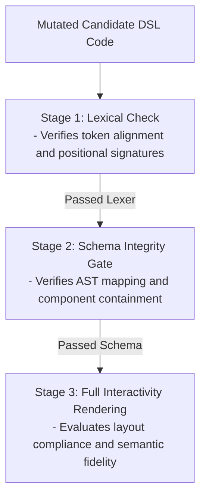

# Design Document: Evolutionary Multi-Agent Optimization Framework for A2UI Inference DSLs

## Executive Summary and System Context

In modern client-side application engineering, Agent-to-User Interface (A2UI) architectures establish a dynamic modality where user interfaces are generated in real-time by large language models (LLMs) to match immediate task contexts. To bypass the high latencies and failure rates associated with raw code generation, optimized implementations utilize an intermediate representation known as an inference Domain-Specific Language (DSL). The baseline A2UI Express specification uses positional signatures, alphanumeric variables, a mandatory `root` entry point, and `$` data bindings to flatten hierarchical layout trees into dense adjacency lists. This structural compression reduces output token footprints by 55% to 70% compared to standard layout representations.

However, defining the optimal grammar rules and the corresponding instructions in system prompts is highly sensitive to phrasing, requiring a laborious manual process of trial and error. If the DSL grammar is overly compressed, the model's performance may degrade, triggering local correction loops that exhaust the reasoning token budget. Conversely, if the DSL grammar is too verbose, it compromises latency and operational margins.

This document details the architectural design of an automated, evolutionary multi-agent optimization framework. Operating within a distributed sandboxed execution environment, the framework integrates state-of-the-art developments in evolutionary computation—specifically Promptbreeder, Optimization by PROmpting (OPRO), Large Language Model Evolutionary Algorithm (LLaMEA), and Genetic-Pareto (GEPA) prompt evolution. By running parallel evaluations of candidate DSL variants across isolated worker nodes and incorporating a cost-optimized, multi-stage evaluation pipeline, the system systematically guides the evolution of DSL syntaxes and system prompts toward optimal performance configurations.

## Architectural Comparison of Optimization Paradigms

To establish a design foundation, Table 1 compares state-of-the-art prompt and program optimization frameworks. This analysis guides the selection of mutation operators, search dynamics, and evaluation strategies for the A2UI DSL compilation pipeline.

| Paradigm                              | Search Space                                                    | Mutation Mechanics                                                                                    | Evaluation Pipeline                                                     | Optimization Objective                                                                   |
| ------------------------------------- | --------------------------------------------------------------- | ----------------------------------------------------------------------------------------------------- | ----------------------------------------------------------------------- | ---------------------------------------------------------------------------------------- |
| **OPRO**  [cite: 6, 10]         | Monolithic system instructions.                                 | Meta-prompt optimization using the historical evaluation trajectory as in-context exemplars.          | Batch evaluation over validation datasets.                              | Single-objective maximization of task accuracy.                                          |
| **Promptbreeder**  [cite: 3, 5] | Task instructions and self-referential mutation prompts.        | Binary tournament selection, hypermutation, parameter crossover, and context shuffling.               | Iterative generation-based evaluation against training sets.            | Maximize classification or reasoning performance.                                        |
| **LLaMEA**  [cite: 7, 13]       | Executable metaheuristic algorithms written in high-level code. | Abstract Syntax Tree (AST) mutations, unified diff patches, and SMAC hyperparameter tuning.           | Dynamic execution inside evaluation benchmarks (e.g., IOHexperimenter). | Maximize algorithmic convergence metrics (e.g., Area Over Convergence Curve).            |
| **GEPA**  [cite: 8, 18]         | Compound multi-prompt systems with control flow logic.          | Natural language reflection over failure execution traces and errors.                                 | Low-sample trajectory evaluations.                                      | Multi-objective optimization via Pareto-frontier mapping.                                |
| **Proposed A2UI Framework**           | Evolved DSL grammar syntax and compiler-directing prompts.      | Unified diff-based grammar mutations, self-referential prompt hypermutation, and AST-guided feedback. | Distributed multi-stage in-flight rejection with model cascading.       | Pareto-optimal frontier balancing compile rate, token count, fidelity, and compute cost. |

The proposed framework integrates these paradigms into a hybrid approach. It utilizes Promptbreeder’s self-referential hypermutation to evolve natural language directives, adopts LLaMEA's structural AST feedback and diff-mode updates to modify DSL rules, and implements GEPA’s Pareto-aware reflection to maintain balanced design candidates without premature convergence.

## Distributed Sandbox Execution and Orchestration

The computational platform is designed to run within the internal Jetski IDE environment, leveraging underlying distributed hardware nodes to parallelize the evaluation of candidate DSL variations.

Code snippet

### Sandbox Isolation and Parallel Worker Execution

The framework executes a minimum of 10 parallel worker agents inside independent Jetski sessions. Each worker agent is isolated from the others, receiving a distinct mutated DSL grammar specification Gj​ and prompt template Pj​ generated by the central evolutionary optimizer.

To evaluate the generalized utility of a candidate DSL, the testing workload is partitioned across workers. Each worker is assigned a distinct UI schema catalog (such as settings dashboards, multi-step transaction forms, or complex data visualization views), ensuring the evolved syntax is catalog-agnostic and robust to diverse interface patterns.

### Mitigating Agent Scaling Overhead and the Coordination Tax

Large-scale multi-agent deployments can suffer from performance degradation, where adding more agents increases error rates or computational overhead. The proposed framework mitigates these scaling bottlenecks through several structural features:

- **Elimination of Inter-Agent Communication:** Unlike cooperative multi-agent networks that require consensus protocols, the workers in this framework operate independently. They pull candidates from a central queue and write execution metrics to a shared database. This design keeps coordination overhead linear rather than superlinear.
- **Addressing Context Duplication and the Model Context Protocol (MCP) Tax:** Repeatedly sending comprehensive component schemas and tool definitions across multiple steps can add up to 10,000 to 60,000 redundant tokens per turn. To minimize this overhead, the system leverages prefix-based prompt caching. Common system contexts and validation rules are compiled into a shared prefix, allowing workers to retrieve cached computations and reduce input token expenses.
- **Deterministic Execution Guardrails:** Rather than allowing models to autonomously manage retry loops, execution boundaries are managed programmatically. If an agent worker encounters a compilation error, the sandbox halts execution and logs the error trace directly to the reflective evaluation database. This prevents run-away loops and keeps compute costs bounded.

## Evolutionary Engine and Genetic Operators

The optimization engine is structured as an offline evolutionary search. A candidate individual in the population is defined as a tuple:

xi​=(Gi​,Pi​)

where Gi​ represents the discrete DSL grammar rules (defining signature notations, variable declarations, and list structures) and Pi​ represents the natural language compiler prompt. The initial population x0​ is initialized using the base A2UI Express specification and standard system instructions.

### The Mutator and Self-Referential Operators

To evolve these candidates, the system employs a high-reasoning Gemini instance acting as a meta-agent mutator. The mutation of task-prompts is governed by a population of mutation-prompts, which are themselves mutated over successive generations. The framework implements a comprehensive suite of mutation operators mapped to the A2UI DSL domain, as shown in Table 2.

| Operator Category                         | Mutation Operator                                                         | Operational Definition                                                                                        | A2UI DSL Domain Mapping                                                                     |
| ----------------------------------------- | ------------------------------------------------------------------------- | ------------------------------------------------------------------------------------------------------------- | ------------------------------------------------------------------------------------------- |
| **Direct Mutation**  [cite: 11]     | Zero-Order Generation                                                     | Generates a prompt or grammar variation from a broad conceptual baseline.                                     | "Redesign the layout syntax to maximize structural grouping."                               |
| First-Order Generation                    | Applies localized, granular changes to an existing prompt or grammar.     | "Change the nesting delimiter from curly braces to brackets to save tokens."                                  |
| **EDA Mutation**  [cite: 28]        | Estimation of Distribution                                                | Analyzes common features of successful parents to synthesize a new candidate.                                 | Combines the symbolic event notation of parent A with the variable declaration of parent B. |
| Rank and Index Mutation                   | Generates new candidates based on ranked successful traits.               | "Adapt the compact positioning rules from the top 3 ranked syntaxes."                                         |
| Lineage-Based Mutation                    | Evaluates historical progress over generations to guide updates.          | Translates historical changes into rules to avoid repeating past failure modes.                               |
| **Hypermutation**  [cite: 28]       | Zero-Order Hyper-Mutation                                                 | Proposes a new optimization style for mutation-prompts.                                                       | "Suggest modifications as if you are a senior assembly compiler engineer."                  |
| First-Order Hyper-Mutation                | Modifies an existing mutation-prompt to improve its clarity.              | "Change 'Simplify prompt instructions' to 'Remove redundant constraints and focus on component definitions.'" |
| **Lamarckian Mutation**  [cite: 28] | Dynamic Adaptation                                                        | Incorporates feedback from successful runtime strategies into the instructions.                               | Integrates successful correction rules from micro-refinement loops into system prompts.     |
| **Recombination**  [cite: 28]       | Prompt Crossover                                                          | Merges discrete components from two high-performing parent prompts.                                           | Combines parent A's error-handling prompt with parent B's layout-rendering prompt.          |
| Context Shuffling                         | Reorders few-shot exemplars in the prompt to alter model attention focus. | Reorders simple vs. complex layout exemplars to evaluate its impact on generation quality.                    |

The evolutionary loop uses a binary tournament selection process. Two candidate configurations are randomly sampled, and their performance is evaluated. The lower-performing candidate is replaced with a mutated version of the superior candidate, continuously driving the population toward better-performing configurations.

### Unified Diff-Mode and LLaMEA Integration

To optimize network bandwidth and prompt processing overhead, the framework uses LLaMEA’s unified diff mode. Instead of rewriting the entire system prompt or compiler codebase on every iteration, the mutator outputs unified patch diffs representing targeted changes. This reduces token consumption during mutation steps and makes the optimization log more readable.

Additionally, the framework integrates LLaMEA’s niching strategies (implementing sharing and clearing algorithms relative to a defined niche radius). This prevents the population from clustering around a single grammar layout style, ensuring the search maintains diverse candidate syntaxes. For numerical values within prompts (such as temperature, top-p, or execution timeouts), the framework runs an in-the-loop Hyperparameter Optimization (HPO) pipeline using sequential model-based algorithm configuration (SMAC), offloading numerical tuning so the LLM queries can focus on structural improvements.

### AST Graph-Theoretic Feedback and Explainable AI

To prevent the generation of syntactically unparsable DSL grammars, the optimizer utilizes code-centric feedback modeled after LLaMEA-SAGE. When a candidate DSL variant is executed, the generated code is parsed into an Abstract Syntax Tree (AST) represented as a directed graph Gc​=(V,E).

From Gc​, the framework extracts graph-theoretic statistics, including node and edge counts, tree depth statistics, degree statistics, clustering coefficients, and nested function densities. A surrogate model trained on historical evaluation runs maps these AST features to structural layout success. Using explainable AI, the system translates high-performing AST graph properties into natural language optimization prompts, biasing the mutator toward structurally robust grammar variations.

## Cost-Effective Multi-Stage Evaluation Pipeline

To make continuous evolutionary search economically viable, the evaluation pipeline is designed to minimize inference costs, maximizing throughput per dollar spent.

Code snippet

### Multi-Stage In-Flight Rejection

The evaluation pipeline applies Multi-Stage In-Flight Rejection (MSIFR) to prevent completing expensive generation processes for invalid DSL structures. The compilation is executed as a series of progressive checkpoints:

1.  **Lexical Gate:** Checks the raw layout code for syntax errors, matching parentheses, and positional alignment.
2.  **Schema Gate:** Parses the stream into an AST and verifies the structural mapping of A2UI components against schema rules.
3.  **Compilation Gate:** Runs the layout through the layout flattener to verify the final compiled output.

At each checkpoint, if a candidate's output violates formatting or schema constraints, the execution trajectory is immediately terminated, and the candidate is assigned a failing score. This early-exit mechanism avoids full autoregressive decoding of invalid outputs, reducing token consumption in the evaluation pipeline by 11% to 77%.

### Tiered Model Routing and Cascading

To bypass the high operational costs of premium, frontier-class LLMs, the pipeline leverages model cascading and routing. The framework dynamically distributes computational tasks based on programmatic assessment of task complexity:

- **Structural Parsing and Formatting (Budget-Tier):** Basic syntax parsing and initial compilation-correctness checking are routed to highly optimized Small Language Models (SLMs) such as Gemma 2B or fine-tuned budget models. These models execute at a tiny fraction of the cost of frontier platforms.
- **Semantic Verification (Mid-Tier):** Validation tasks that evaluate layout correctness are handled by medium-sized models.
- **Complex Evolutionary Operations (Premium-Tier):** Frontier models (such as Claude 3.5 Sonnet or Gemini 3 Pro) are reserved exclusively for the high-level mutation tasks and reflective failure evaluations where extreme abstract design capabilities are required.

### Speculative Execution and Cache Management

The evaluation platform couples runtime efficiency with infrastructure optimizations to protect against underutilized hardware capacity.

- **Speculative Drafting:** Utilizing first-layer speculative decoding, a smaller draft model predicts intermediate layout declarations, which are verified in parallel by the target compiler model. This strategy minimizes latencies for long-form layout outputs.
- **Two-Tier Caching:**
  - Exact & Semantic Caching: Repeated UI generation commands are intercepted by an in-memory cache layer. Using vector embeddings with a high cosine similarity threshold (typically ≥0.92), the system serves previously verified layouts, bypassing fresh LLM calls entirely.
  - Prefix Caching: Evolved system prompts and catalog definitions are cached at the API provider level. This cuts downstream input charges by up to 90% during recursive evaluations.

Table 3 highlights the quantitative impacts of these integrated runtime optimizations on evaluation overhead.

| Optimization Strategy                                  | Operational Mechanism                                                           | Direct Token Volume Impact                                    | VRAM Efficiency                                                      | Latency Impact                                                   |
| ------------------------------------------------------ | ------------------------------------------------------------------------------- | ------------------------------------------------------------- | -------------------------------------------------------------------- | ---------------------------------------------------------------- |
| **MSIFR (Early-Exit Checkpoints)**  [cite: 2]    | Terminates generation if syntax or schema constraints are violated.             | Reduces generation token consumption by 11% to 77%.           | Frees KV cache space by terminating unproductive sessions.           | Significant latency reduction on invalid pipelines.              |
| **Tiered Model Routing & Cascading**  [cite: 36] | Routes grammar checks to Gemma 2B; reserves Gemini for mutation and reflection. | Reallocates up to 70% of evaluation queries to budget models. | Fits active models in smaller VRAM configurations (e.g., AWQ 4-bit). | Substantially lowers overall cost; maintains acceptable latency. |
| **Prefix / Prompt Caching**  [cite: 13]          | Hashes static layout catalog signatures and system rules.                       | Reduces input token costs by up to 90% on cache hits.         | Lowers memory bandwidth pressure on long system prefixes.            | Achieves up to an 80% reduction in time-to-first-token.          |
| **Semantic Caching**  [cite: 35]                 | Uses vector embeddings to match semantically similar layout queries.            | Avoids redundant generation calls for 30% to 60% of requests. | Replaces model inference passes with quick database lookups.         | Drops response times from several seconds to millisecond ranges. |

## Mathematical Formulation of the Fitness Function

To systematically guide the evolutionary mutator toward candidate configurations that satisfy production constraints, the framework evaluates each evolved DSL variant x=(G,P)—comprising a grammar specification G and an inference prompt template P—using a multi-objective fitness formulation.

The primary objective is to maximize the performance vector **F**(x) across four fundamental axes: compilation reliability, token compression, semantic compliance, and inference cost optimization.

xmax​**F**(x)=[C(x),T(x),S(x),−E(x)]T

### 1. Compilation Success Rate (C)

The metric C(x) evaluates the structural and syntactic validity of the compiled output across a validation dataset of layout tasks D={d1​,d2​,…,dN​}. It is defined as:

C(x)=N1​i=1∑N​I(AST_Valid(x,di​))

where I(⋅)={10​if layout code parses and compiles without errorotherwise​

This metric acts as a rigorous filter, penalizing candidate grammars that yield unparsable outputs, mismatched signatures, or nested assignment errors.

### 2. Token Compression Ratio (T)

To optimize transmission bandwidth and token consumption, T(x) measures the output size reduction achieved by the mutated DSL representation relative to the raw, uncompressed layout baseline format:

T(x)=N1​i=1∑N​max(0,Tokensbase​(di​)Tokensbase​(di​)−Tokensx​(di​)​)

where Tokensx​(di​) is the token count of the output compiled with mutation x[cite:1].

Candidates are penalized if they do not achieve a target token compression ratio within the benchmark range of 55% to 70%.

### 3. Semantic Fidelity Score (S)

To verify that the compressed representation retains layout semantics, the framework uses a calibrated LLM-as-a-judge process. Evaluated against a golden dataset Ggold​ of 30 to 200 expert-labeled examples, the semantic fidelity metric is defined as:

S(x)=N1​i=1∑N​Judge_Score(x,di​)

where Judge_Score(x,di​)∈[0,1] is the normalized evaluation score [cite: 31].

To ensure reliability, the evaluation pipeline incorporates several guardrails:

- **Calibration:** The evaluator calculates the agreement rate with human annotators, requiring a minimum Cohen's Kappa of κ≥0.80 to confirm scoring stability.
- **Bias Mitigation:** To mitigate presentation order and self-enhancement biases, the judge runs pairwise comparisons twice with candidate order swapped, and the results are averaged.
- **Rubric Structure:** The evaluation prompt implements a strict multi-dimensional rubric assessing color harmony, spatial composition, interactive relationships, and attribute containment.

### 4. Normalized Inference Cost (E)

To prevent the selection of prompts that trigger excessive computing resource consumption or run afoul of layout latency constraints, the framework tracks execution and generation expenditures:

E(x)=w1​⋅(Token_Capin​Input_Tokens(x)​)+w2​⋅(Token_Capout​Output_Tokens(x)​)+w3​⋅(Budgetreason​Stepsreason​(x)​)

Subject to the hard constraint: Stepsreason​(x)≤560 tokens

The parameter Stepsreason​(x) maps to the generation path complexity of the local compiler. The constraint forces the optimizer to discard DSL syntax configurations that trigger excessive local adjustments, keeping execution footprints within the budgets of on-device processing units.

### Pareto Dominance and Crowding Distance Selection

Because the objectives are often in conflict, the framework utilizes Pareto dominance to identify optimal configurations instead of combining metrics into a single weighted score. A candidate configuration x1​ strictly dominates x2​ (denoted as x1​≻x2​) if:

∀j∈{C,T,S,−E},fj​(x1​)≥fj​(x2​)

and ∃j∈{C,T,S,−E},fj​(x1​)>fj​(x2​)

During selection, the framework uses the NSGA-II algorithm to sort candidates into non-dominated fronts, using crowding distance metrics to maintain a diverse selection of candidates along the front.

This Pareto-based selection allows the system to identify "knee points"—configurations where small sacrifices in compression yield substantial improvements in compilation success and visual accuracy.

## Architectural Workflow and Execution Roadmap

To successfully deploy the evolutionary framework within the execution environment, the operational loop progresses through a series of structured stages:

Code snippet

### Stage 1: Population Initialization and Seeding

- The system loads the base A2UI Express grammar and seed system prompts into the central evolutionary registry.
- A validation suite of target layouts and component catalogs is distributed across the workspace database.

### Stage 2: Self-Referential Mutation and AST Analysis

- The high-reasoning Gemini meta-agent processes the current population, applying self-referential hypermutation and unified diff operators to generate new candidate variants.
- The LLaMEA-SAGE analyzer inspects AST structures from successful historical runs, injecting code-centric feedback into the mutation prompts to steer the syntax toward stable patterns.

### Stage 3: Distributed Sandbox Evaluation

- The central orchestrator dispatches the candidate variants to 10 isolated Jetski worker sandboxes running in parallel.
- Each sandbox evaluates candidate performance across its assigned UI layout tests.

### Stage 4: Cost-Aware Verification and Filtering

- The worker execution engine applies MSIFR checkpoints, terminating invalid syntax trajectories early to minimize token usage.
- The runtime routes basic parsing steps to Gemma 2B while reserving Gemini 3 Pro for multi-stage evaluation and reflective feedback analysis.

### Stage 5: Metric Aggregation and Pareto Sorting

- The evaluation engine collects performance metrics from the workers, computing the multi-objective fitness scores.
- The system performs non-dominated sorting to update the Pareto frontier, preserving high-performing configurations.
- A developer interface optionally supports human-in-the-loop review of the top 3 Pareto-optimal DSL variants before rolling over to the next evolutionary epoch.

Through continuous cycles of parallelized, cost-conscious evolutionary exploration, the system automatically adapts to design requirements, converging on a highly optimized, compact, and structurally reliable A2UI layout configuration.

- [What is Prompt Optimization? | IBM](https://www.ibm.com/think/topics/prompt-optimization)
- [Promptbreeder: Self-Referential Self-Improvement - arXiv](https://arxiv.org/pdf/2309.16797)
- [How to Optimize Machine Learning Inference Costs and Performance - Redis](https://redis.io/blog/machine-learning-inference-cost/)
- [Promptbreeder: Self-Referential Self-Improvement via Prompt Evolution | OpenReview](https://openreview.net/forum?id=HKkiX32Zw1)
- [Large Language Models as Optimizers - arXiv](https://arxiv.org/pdf/2309.03409)
- [XAI-liacs/LLaMEA: Large Language Model Evolutionary Algorithm - GitHub](https://github.com/XAI-liacs/LLaMEA)
- [GEPA: Reflective Prompt Evolution Can Outperform Reinforcement Learning - OpenReview](https://openreview.net/forum?id=RQm2KQTM5r)
- [Know When To Fold 'Em: Token-Efficient LLM Synthetic Data Generation via Multi-Stage In-Flight Rejection - arXiv](https://arxiv.org/html/2605.14062v1)
- [Automatic Prompt Optimization OPRO Implementation with Amazon Bedrock - GitHub](https://github.com/bhorev/automatic-prompt-optimization)
- [Promptbreeder: Self-Referential Self-Improvement Via Prompt Evolution - BayJarvis Blog](https://blog.bayjarvis.com/paper/promptbreeder-self-referential-self-improvement-via-prompt-evolution)
- [Promptbreeder: Automating Prompt Optimization - Emergent Mind](https://www.emergentmind.com/topics/promptbreeder)
- [LLaMEA: A Large Language Model Evolutionary Algorithm for Automatically Generating Metaheuristics - arXiv](https://arxiv.org/html/2405.20132v3)
- [Natural Computing Group: LLaMEA](https://naco.liacs.nl/projects/2024-llamea/)
- [LLaMEA-SAGE: Guiding Automated Algorithm Design with Structural Feedback from Explainable AI - arXiv](https://arxiv.org/html/2601.21511v1)
- [Prompt's Evolution for Language Model-Driven Data Generation - MDPI](https://www.mdpi.com/2076-3417/15/24/12911)
- [[2405.10276] Revisiting OPRO: The Limitations of Small-Scale LLMs as Optimizers - arXiv](https://arxiv.org/abs/2405.10276)
- [GitHub - gepa-ai/gepa: Optimize Prompts, Code, and More with AI-Powered Reflective Text Evolution](https://github.com/gepa-ai/gepa)
- [5 Ways to Optimize Costs and Latency in LLM-Powered Applications - Maxim AI](https://www.getmaxim.ai/articles/5-ways-to-optimize-costs-and-latency-in-llm-powered-applications/)
- [Google Tested 180 Agent Setups. Multi-Agent Made Things 70% Worse. - Reddit](https://www.reddit.com/r/AI_Agents/comments/1s8gf6f/google_tested_180_agent_setups_multiagent_made/)
- [Multi-Agent Cost Compounding: Why 3 Agents Cost 10x | Augment Code](https://www.augmentcode.com/guides/multi-agent-cost-compounding)
- [EVOAL: A Domain-Specific Language-Based Approach to Optimisation](https://tore.tuhh.de/entities/publication/622e30a0-2505-4258-a6ec-761effde6393/)
- [A Systematic Survey on Large Language Models for Evolutionary Optimization: From Modeling to Solving - arXiv](https://arxiv.org/html/2509.08269v1)
- [10 AI Cost Optimization Strategies for 2026: Reduce Your AI Spend by 70%](https://www.aipricingmaster.com/blog/10-AI-Cost-Optimization-Strategies-for-2026)
- [What Are You Actually Paying for LLMs in Production? Any Real Cost Optimization Wins? - Reddit](https://www.reddit.com/r/LLMDevs/comments/1spz0fm/what_are_you_actually_paying_for_llms_in/)
- [Domain-Specific LLM Adaptation: Bridging Personalization and Efficiency Through Synthetic Data and Optimization - Amazon Science](https://www.amazon.science/publications/domain-specific-llm-adaptation-bridging-personalization-and-efficiency-through-synthetic-data-and-optimization)
- [GEPA: Reflective Prompt Evolution — Why Optimizing Prompts Can Beat Reinforcement Learning - Medium](https://medium.com/@sankalpsbahad/gepa-reflective-prompt-evolution-why-optimizing-prompts-can-beat-reinforcement-learning-85867f705f12)
- [Revisiting OPRO: The Limitations of Small-Scale LLMs as Optimizers - arXiv](https://arxiv.org/html/2405.10276v1)
- [[2601.21511] LLaMEA-SAGE: Guiding Automated Algorithm Design with Structural Feedback from Explainable AI - arXiv](https://arxiv.org/abs/2601.21511)
- [Reducing LLM Inference Cost With Small Language Models - AIVeda](https://aiveda.io/blog/reducing-llm-inference-cost-with-small-language-models/)
- [Evolutionary Prompt Optimization Discovers Emergent Multimodal Reasoning Strategies - arXiv](https://arxiv.org/pdf/2503.23503)
- [LLM Inference Optimization: Techniques That Actually Reduce Latency and Cost](https://dev.to/damasosanoja/llm-inference-optimization-techniques-that-actually-reduce-latency-and-cost-3fjg)
- [Reducing Inference Costs for GenAI - UbiOps](https://ubiops.com/reducing-inference-costs-for-genai/)
- [PPSD: Pipeline Parallelism is All You Need for Optimized Early-Exit Based Self-Speculative Decoding - arXiv](https://arxiv.org/html/2509.19368v1)
- [LLM Token Optimization: Cut Costs & Latency in 2026 - Redis](https://redis.io/blog/llm-token-optimization-speed-up-apps/)
- [When Large Language Models Meet Evolutionary Algorithms: Potential Enhancements and Challenges - PMC](https://pmc.ncbi.nlm.nih.gov/articles/PMC11948732/)
- [Optimizing Inference Costs: The Complete Guide - Mirantis](https://www.mirantis.com/blog/inference-costs/)
- [How to Cut AI Inference Costs 2026: Batching, Caching & More - LockLLM Blog](https://www.lockllm.com/blog/reduce-ai-costs)
- [Pareto Prompt Optimization - OpenReview](https://openreview.net/forum?id=HGCk5aaSvE)
- [LLM as a Judge: Primer and Pre-Built Evaluators - Arize AI](https://arize.com/llm-as-a-judge/)
- [What is an LLM-as-a-Judge? When to Use It - Braintrust](https://www.braintrust.dev/articles/what-is-llm-as-a-judge)
- [How to Optimize Your LLM Judge for AI Evaluations - Galtea AI](https://www.galtea.ai/blog/llm-as-a-judge-evaluation)
- [Toward Quantifiable Human–AI Aesthetic Coherence and Collaboration - Taylor & Francis](https://www.tandfonline.com/doi/full/10.1080/10447318.2026.2639656)
- [Optimizing Generative AI Prompts - AWS Prescriptive Guidance](https://docs.aws.amazon.com/prescriptive-guidance/latest/gen-ai-lifecycle-operational-excellence/dev-experimenting-prompt-optimization.html)
- [LLM-as-a-Judge: How to Build Reliable, Scalable Evaluation for LLM Apps and Agents - Comet](https://www.comet.com/site/blog/llm-as-a-judge/)
- [Exploring LLM-as-a-Judge - Weights & Biases](https://wandb.ai/site/articles/exploring-llm-as-a-judge/)
- [DetailMaster: Can Your Text-to-Image Model Handle Long Prompts? - arXiv](https://arxiv.org/html/2505.16915v3)
- [Pareto Prompt Optimization - OSTI](https://www.osti.gov/servlets/purl/2543057)
- [MOPO: Multi-Objective Prompt Optimization for Affective Text Generation - ACL Anthology](https://aclanthology.org/2025.coling-main.375.pdf)
- [Stop Arguing About Prompts: Build a Pareto Frontier Instead - Medium](https://medium.com/@Micheal-Lanham/stop-arguing-about-prompts-build-a-pareto-frontier-instead-61af0995dba3)
